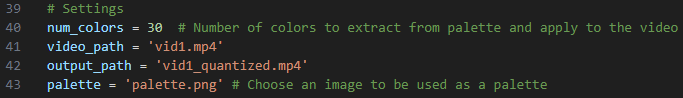

<br />
<div align="center">
  
<h3 align="center">Video color quantization</h3>

  <p align="center">
    Simple programs for video color quantization
</div>

## About The Project
Performs a pixel-wise Vector Quantization (VQ) of all the frames in a video, 
reducing the number of colors required to show the image, then saves the video
to a new file. The `video_quantize.py` program chooses colors for each frame 
individually, `video_quantize_pallete.py` takes colors from a "palette" first
and then these colors are applied to every frame. The palette can be any image,
but palettes of colors used in pixel art give predictable results.


## Usage
To use the programs, specify the parameters inside the code. By default it
takes a video named 'vid1.mp4' and reduces the number of colors to 30. A sample
video and palette are provided in the repository for testing purposes.



Running the program on a sample video gives the following results for 30 colors, where the first gif is the original video, the second is 
from `video_quantize.py` and the third is from `video_quantize_pallete.py`.


<p align="center">
  
  
  
</p>

As we can see choosing a palette gives more stable results with less 
flickering, but in this case the chosen palette didn't have good colors
to represent the video.

## Prerequisites
To run the program, a few packages are required:

* numpy
  ```sh
  pip install numpy
  ```
* matplotlib
  ```sh
  pip install matplotlib
  ```
* scikit-learn
  ```sh
  pip install scikit-learn
  ```
* Pillow (PIL)
  ```sh
  pip install Pillow
  ```
* scikit-image
  ```sh
  pip install scikit-imag
  ```
* opencv
  ```sh
  pip install opencv-python
  ```
